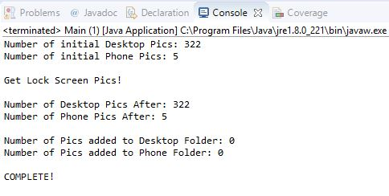

# Windows 10 PicGrabber
The lock screen for Windows 10 generally has a very nice picture that would make a perfect desktop background. For example like the image below: 


With my PicGrabber program you can grab the lock screen image and save it into the folder of your choice! Along with this in the folder where the lock screen picture is located there are usually a few other secret desktop background along with some phone background!

For example, when I ran this program today I got the following images:

[sunset_desktop_background](readme_pics/desktop_sunset.jpg)

[sunset_phone_background](readme_pics/phone_sunset.jpg)

The fun thing is that neither of these pictures was currently my lock screen. After running the program it gave me 5 new desktop backgrounds and 5 new phone backgrounds (along with the current lock screen picture)!

## Preliminary steps
The PicGrabber program is a Java program. All that is included in this repository is the Main.java file for the program. It is not a complicated program so any development environment that has all of the java standard libraries should do. Unfortunately, I have not had the time or effort to create an executable with a GUI. However, the PicGrabber can be run through any Java IDE. I personally use [Eclipse Jee Oxygen](https://www.eclipse.org/downloads/).

I'm not going to include any download instructions in this repository because those can be found through many other sources! However, once you set up your IDE you should be able to just use my included Main.java file!

## Update Main.java
Before you run the program you need to change three file paths in the Main.java code. Basically you have to specify your username directory (this is the folder that contains Desktop, Documents, Pictures, etc.)

On line 13 change the value of [USERNAME] or specify an entirely different directory to save the desktop background images
The reason I chose this specific folder is explained below!

```
public final static String Desktop_Background_Folder = "C:\\Users\\[USERNAME]\\AppData\\Local\\Microsoft\\Windows\\Themes\\CustomPics";
```

On line 14 change the value of [USERNAME] or specify entirely different directory to save the phone background images
```
public final static String Phone_Background_Folder = "C:\\Users\\[USERNAME]\\Pictures\\Phone_Backgrounds";
```

on line 20 change the value of [USERNAME] (don't change the rest of the filepath)

```
public final static String lockPicFolder = "C:\\Users\\[USERNAME]\\AppData\\Local\\Packages\\Microsoft.Windows.ContentDeliveryManager_cw5n1h2txyewy\\LocalState\\Assets";
```
Other than these three values nothing else needs to be changed

## Running Pic Grabber
Once the code is updated running the program should be very simple! All you need to do is open up your IDE and run the program whenever you see a new lock screen picture! 

Once you run the program you should see something like this: 




