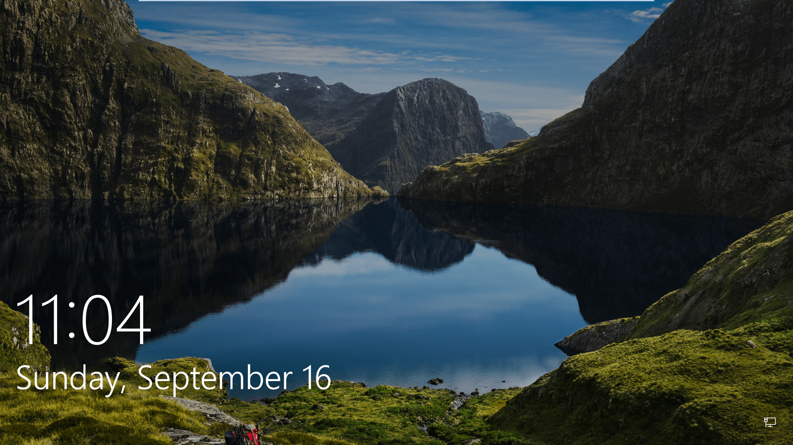

# Windows 10 PicGrabber
The lock screen for Windows 10 generally has a very nice picture that would make a perfect desktop background. For example like the image below: 

With my PicGrabber program you can grab the lock screen image and save it into the folder of your choice!

## Preliminary steps
The PicGrabber program is a Java program. All that is included in this repository is the Main.java file for the program. It is not a complicated program so any development environment that has all of the java standard libraries should do. Unfortunately, I have not had the time or effort to create an executable with a GUI. However, the PicGrabber can be run through any Java IDE. I personally use [Eclipse Jee Oxygen](https://www.eclipse.org/downloads/).
